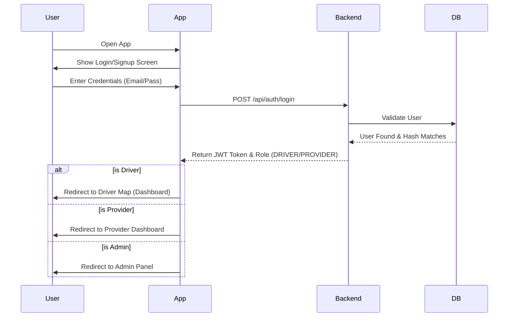

# ParkEase Project - Detailed Flow Charts

## 1. System Architecture Overview

```mermaid
graph TD
    User[📱 User (Driver/Provider)] -->|HTTPS/REST API| Frontend[⚛️ React Native App]
    Frontend -->|Axios Requests| Backend[☕ Spring Boot Server]
    Backend -->|JPA/Hibernate| DB[(🗄️ H2/MySQL Database)]
    
    subgraph "Backend Services"
        AuthController
        DriverBookingController
        ProviderParkingController
        AdminController
    end
    
    Backend --> AuthController
    Backend --> DriverBookingController
    Backend --> ProviderParkingController
```

## 2. User Authentication Flow



## 3. Provider Workflow (Multi-Spot Management)

```mermaid
graph TD
    Start(Provider Logged In) --> Dashboard[📊 Provider Dashboard]
    Dashboard -->|View Stats| Earnings[💰 View Earnings & Occupancy]
    Dashboard -->|Manage Parking| MySpots[🅿️ My Parking Spots]
    
    MySpots -->|Action| FetchSpots[GET /api/provider/parking/provider/{id}]
    FetchSpots -->|Display| SpotList[List of Active Spots]
    
    MySpots -->|Action| AddSpot[➕ Add New Spot]
    AddSpot --> InputForm[Enter Name, Address, Price, Lat/Lng]
    InputForm -->|Save| CreateAPI[POST /api/provider/parking/add]
    CreateAPI -->|Success| DBUpdate1[(Save New ParkingLot)]
    DBUpdate1 --> SpotList
    
    SpotList -->|Select Spot| DeleteSpot[🗑️ Delete Spot]
    DeleteSpot --> DeleteAPI[DELETE /api/provider/parking/delete/{id}]
    DeleteAPI -->|Success| DBUpdate2[(Remove ParkingLot)]
    DBUpdate2 --> SpotList
```

## 4. Driver Booking Flow

```mermaid
graph TD
    Driver[🚗 Driver Logged In] --> MapView[🗺️ Map View]
    MapView -->|Search/Pan| SearchAPI[GET /api/driver/parking/search]
    SearchAPI -->|Return Spots| MapMarkers[📍 Display Parking Markers]
    
    MapMarkers -->|Click Marker| SpotDetails[🅿️ Spot Details (Price, Slots)]
    SpotDetails -->|Action| BookBtn[📅 Book Now]
    
    BookBtn --> BookingForm[Select Start/End Time]
    BookingForm -->|Confirm| Pay[💳 Payment (Wallet/UPI)]
    
    Pay -->|Process| BookingAPI[POST /api/driver/bookings]
    BookingAPI -->|Check Balance| WalletCheck{Sufficient Balance?}
    
    WalletCheck -- Yes --> ConfirmBooking[✅ Booking Confirmed]
    WalletCheck -- No --> FailBooking[❌ Insufficient Funds]
    
    ConfirmBooking --> Ticket[🎫 View Booking Ticket]
    ConfirmBooking --> UpdateSlots[(Database: Mark Slot Occupied)]
```

## 5. Technical Data Flow

**Frontend (React Native)**
- **State Management**: React Hooks (`useState`, `useEffect`, `useContext`).
- **Networking**: `Axios` (Pre-configured in `api.ts` with Base URL).
- **Navigation**: `Expo Router` (File-based routing).

**Backend (Spring Boot)**
- **Controller Layer**: Handles HTTP Requests (e.g., `ProviderParkingController`).
- **Service Layer**: Business Logic (Calculations, Validations).
- **Repository Layer**: Data Access (Interfaces extending `JpaRepository`).
- **Database**: H2 (In-Memory) or MySQL (Persistent).

**Key Entites:**
- `User`: Stores Driver and Provider profiles.
- `ParkingLot`: Represents a parking spot/area (One Provider -> Many Lots).
- `ParkingSlot`: Specific spaced within a Lot.
- `Booking`: Connects Driver + ParkingSlot + Transaction.
- `Payment`: Logs financial transactions.
