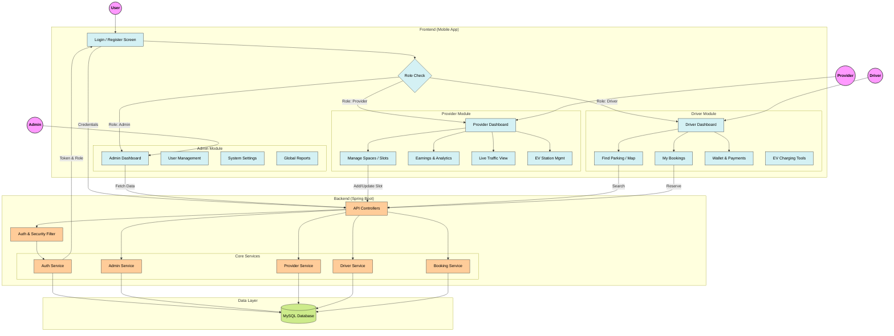

# ParkEase - Smart Parking Management System Flowchart

## Core Workflows Description

### 1. Authentication Flow
- **User** logs in via the mobile app.
- **Frontend** sends credentials to the Backend API.
- **Backend** validates credentials and returns a secure **JWT Token** and **User Role**.
- App routes the user to the specific Dashboard based on their role (Admin, Provider, or Driver).

### 2. Provider Workflow
- **Dashboard:** View real-time occupancy, revenue, and active chargers.
- **Space Management:** Add parking slots, toggle availability, and set pricing.
- **Analytics:** Visualize earnings trends (daily/weekly/monthly).

### 3. Driver Workflow
- **Search:** Find parking spots on a map with real-time availability.
- **Booking:** Reserve a spot in advance.
- **Navigation:** Get directions to the parking lot.
- **Eco:** View EV charging infrastructure and track eco-points.

### 4. Admin Workflow
- **Oversight:** Monitor total system health, user registrations, and platform revenue.
- **Management:** Approve providers and manage user accounts.
